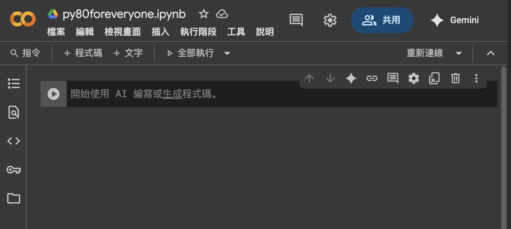
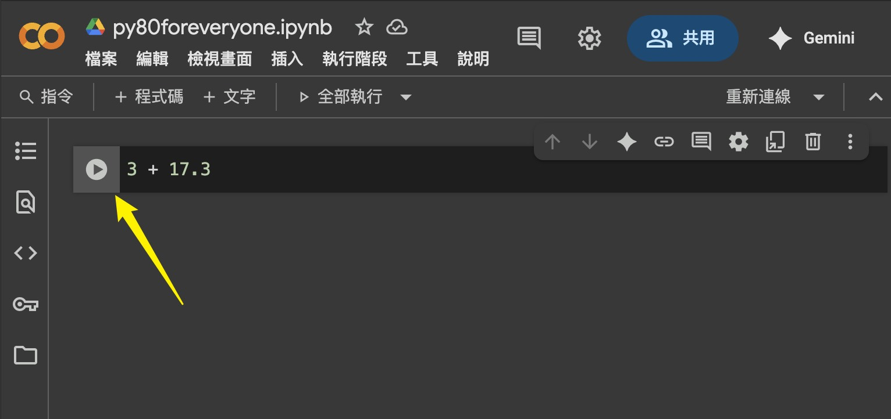
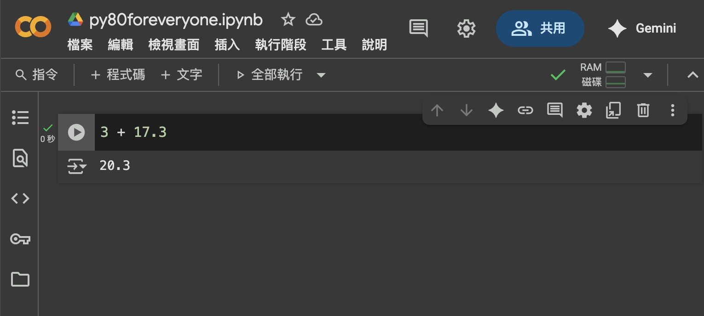
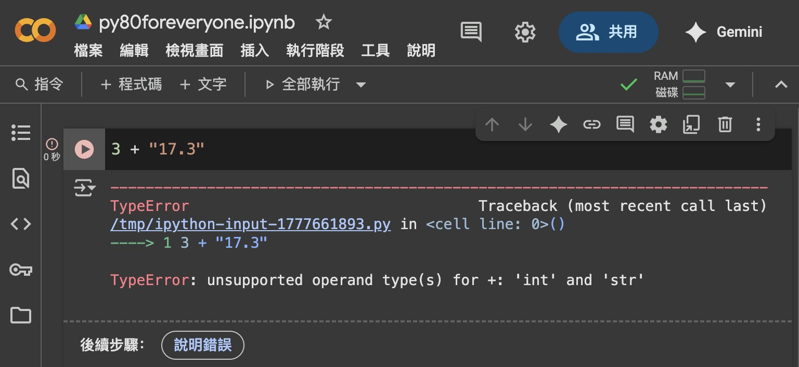
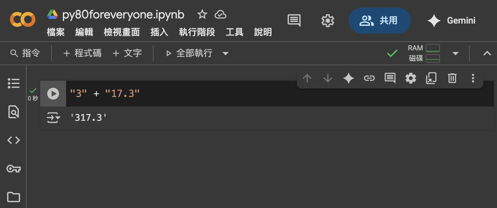

# Python 中最重要的四個型別

## Python 的四種基本型別

分別是：  

1. **數字**：用來表示數值資料，包含整數（`int`）與小數（`float`）。  
2. **字串**（`str`）：用來表示文字資料，通常用單引號 `'這樣'` 或雙引號 `"這樣"` 包起來。
3. **列表**（`list`）：用來表示一系列的資料，用方括號包起來，像是 `["Hello", 9527]`。
4. **字典**（`dict`）：一樣用來表示一系列的資料，它跟列表最大的差異是  
    - 它是以 `key`: `value`的對應方式儲存資料的，就像是對號車廂一樣，我們能根據不同的`key`找到對應的`value`。  
    - 用大括號包起來，像是 `{"country": "Taiwan", "capital": "Taipei", "temperature": 37}`。

---

## 實際操作：數字與字串

接下來我們到 [Google Colab]((https://colab.research.google.com/?hl=zh-tw)) 實際看看 Python 是怎麼運作的。  
> 請先進到 `Google Colab`，並選擇「新建筆記本」，  
> 看到下面這樣就對了。  
  

我們先嘗試輸入 `3 + 17.3`，然後按下左側的執行按鈕，經過一下下後，你應該可以看到下方輸出了 `20.3`。  
  

  

---

接著我們改輸入 `3 + "17.3"` 再執行，這次會出現錯誤訊息。  
因為只有「數字」才能進行四則運算。  
  

---

那麼，如果我們輸入 `"3" + "17.3"` 呢？  
  

  
成功了？ 這是因為 `+` 在 Python 中也代表「連接」。  
程式把 `"3"` 和 `"17.3"` 兩個字串在一起，變成了 `"317.3"` 這個新字串。

---

## 你可以這樣問 AI

- 我有一個 Python `字串`，怎麼讓它全部變大寫？
- Python 中，怎麼把像 `"17.3"` 這樣的字串轉成數字？反過來呢？
- 怎麼加總 Python `列表` 裡的所有數字？
- 怎麼檢查 Python `列表` 中有沒有某個資料？
- 怎麼去除 Python `列表` 中重複的資料？
- 怎麼檢查 Python `字典` 裡有沒有某個 `key`？

---

