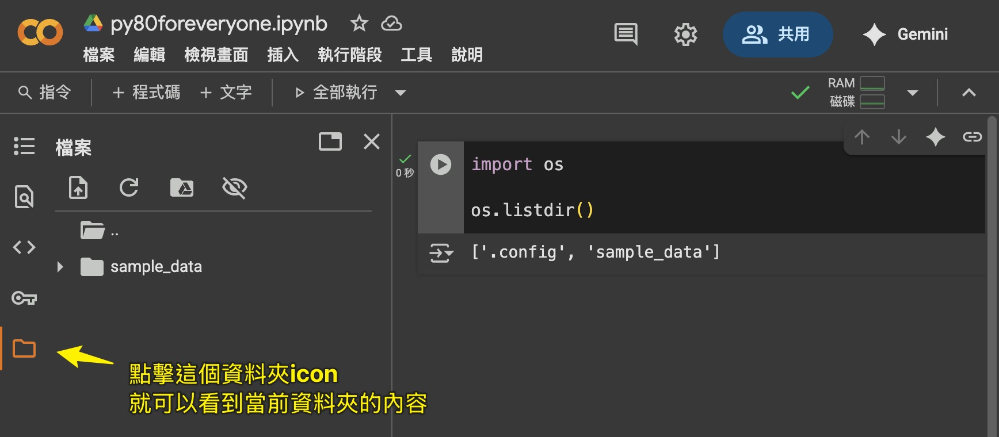
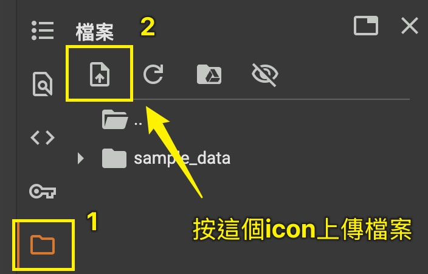
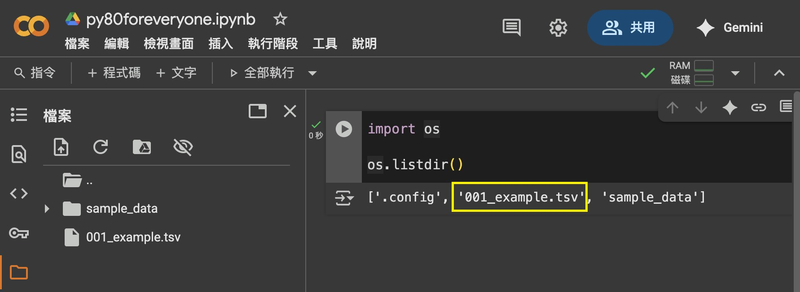
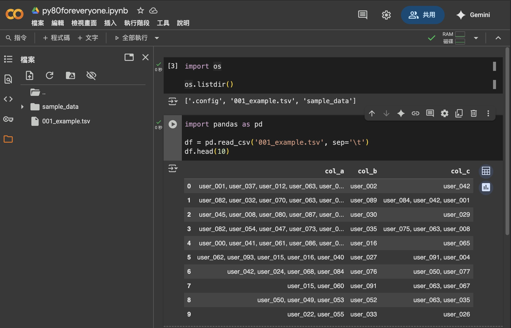

# 如何使用 Python 套件

## 為什麼需要使用套件？  
想用 Python 解決問題，最省力的方式是善用現成的「工具箱」，也就是各種套件。 幾乎所有常見問題都有人寫好套件了，你不需要從頭自己寫。

---

## 那麼...要怎麼使用呢？

1. 直接使用關鍵字 `import` 來引入套件，例如：  
    `import 某個套件的名字`  

2. 有時候套件名字太長，我們也可以為它改名，例如：  
    `import 某個套件的名字 as 我喜歡的縮寫`

---

## 實際操作

### 1. 使用 `os` 套件
我們一樣到 [Google Colab](https://colab.research.google.com/?hl=zh-tw) 實際演練。  
這次我們要使用 `os` 套件，它提供了許多與電腦、文件夾、檔案...互動的功能。  
首先，請輸入並執行以下程式碼：  

```python
import os

# 下面的指令會列出當前目錄的所有檔案
# 而在 Python 中，在前面加上 `#` 的話電腦就不會執行這個命令
# 你可以透過這個小技巧撰寫程式內的筆記 （也叫做註解）

os.listdir()

```

看到這樣的輸出就代表你做對了： `['.config', 'sample_data']` 🚀🚀🚀  
  


---

### 2. 使用 `pandas` 套件

不管我們今天使用的是 80/20 法則還是 50/1 法則，`pandas` 套件都會是你最最最常用的工具。
    
它可以處理像是 `csv`、`tsv`、`excel`...等等 table 類型的資料，只要你的工作包含文書處理，你很大機率會用到它。
  
我準備了一個 [範例檔案](data/001_example.tsv)，請先下載它後、再上傳到 Google Colab。  
  


看到它出現在左邊列表中就成功了，你也可以執行剛剛上面學到的指令查看它是否存在。  
  


---

接下來我們要使用 `pandas` 來讀取這個檔案，並且秀出前10個 rows。  
請輸入以下程式碼：  

```python
import pandas as pd

df = pd.read_csv('data/001_example.tsv', sep='\t')
df.head(10)
```

看到下面這樣的輸出就代表成功了：  
  


> `tsv` 跟 `csv` 很像，它們都是可以用一般文字編輯器打開的純文字檔案。  
只是 `tsv` 檔案用 `tab` 鍵來分隔欄位，而 `csv` 檔案則是用逗號 `,` 來分隔欄位。  
如果你想要讀取 `csv` 檔案，只需要把 `sep='\t'` 改成 `sep=','` 就可以了。

---

## 💬 你可以這樣問 AI

- 我想「做某件事」，有沒有 Python 套件可以幫我完成？ 有的話，請給我套件的名字和簡單的使用範例。
- 我要怎麼在 Google Colab 上面安裝《某個套件的名字》？
- 我需要查找檔案夾裡所有 `.csv` 檔，並且合併成一個大檔案，我該用什麼套件？
- 我有一個 Python list，怎麼快速計算平均值？
- 我要怎麼用 `pandas` 讀取 Excel 檔？ 它的副檔名是 `.xlsx`。

---

## 💤 你可能不需要知道這些東西

1. `['.config', 'sample_data']`代表當前目錄有兩個資料夾（因為它們沒有類似 `.csv` 的副檔名），並且其中一個是隱藏的（因為它的名稱以 `.` 開頭）。   
2. 為什麼需要 `tsv` 檔案？ 因爲有時候我們的資料中會包含對話、或是大量的字串內容，例如：  

    | 姓名   | 自我介紹 | 城市   |
    |--------|------|--------|
    | Lala   | Hi, I am Lala   | Taipei   |
    | Lulu   | Howdy!   | Chiayi   |

    這樣的資料如果用 `csv` 檔案來儲存，就可能因為 `Hi, I am Lala` 中的逗號而被誤解為兩個欄位，導致整份表格錯亂。

---

<script src="https://giscus.app/client.js"
        data-repo="tamio0800/py80foranyone"
        data-repo-id="R_kgDOPWvXEw"
        data-category="[在此輸入分類名稱]"
        data-category-id="[在此輸入分類 ID]"
        data-mapping="pathname"
        data-strict="0"
        data-reactions-enabled="1"
        data-emit-metadata="0"
        data-input-position="top"
        data-theme="preferred_color_scheme"
        data-lang="zh-TW"
        crossorigin="anonymous"
        async>
</script>


