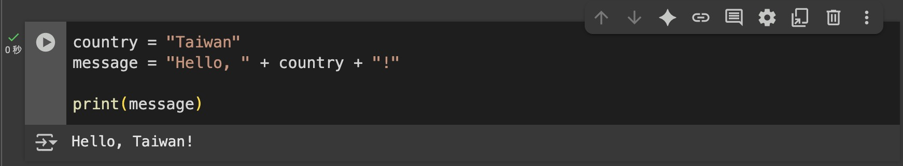
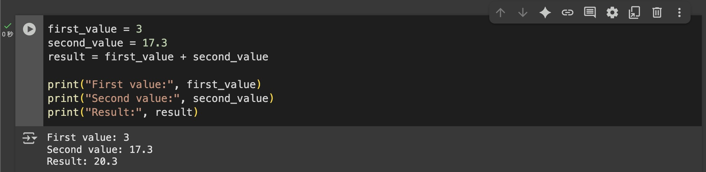
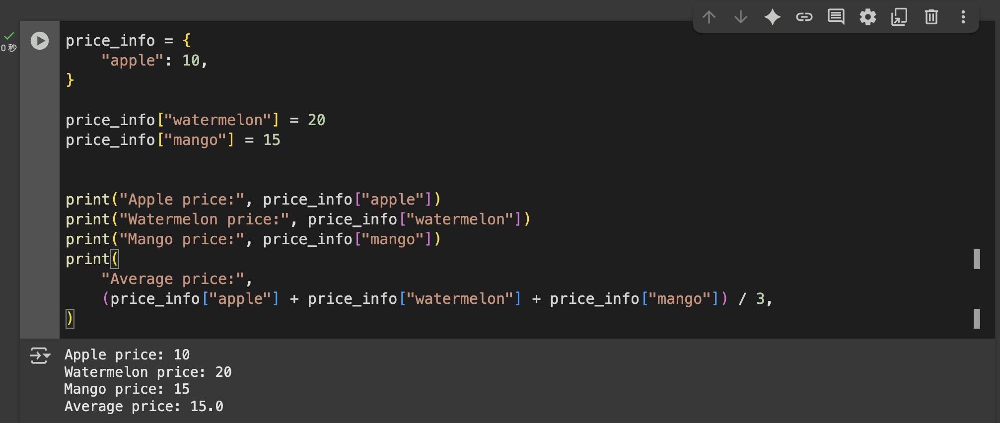

# 什麼是變數

## 變數，就是給資料取名字

就像給盒子貼標籤，之後只要根據標籤，就能順著找到盒子裡的資料，例如：  

```python
name = "華安"
id = 9527  
tags = ["江南四大才子", "畫家", "詩人"]  
family = {"爸爸": "華山", "媽媽": "陳氏", "哥哥": "華嶠"}  
```

- 你在第 3 章中學到的四種基本型別（數字、字串、list、dict），通通能丟進變數。  
- 把盒子和標籤準備好，未來就可以做更複雜的判斷與流程設計。

---
  
要更新資料也很簡單，只要重新賦值就好。  
例如原本是這樣：  
  
```python
boy_friend = "bf_002"
ex_boy_friend = "bf_001"
```

我們可以這樣更新：  

```python
ex_boy_friend = boy_friend
# 這個意思是把 `現任男友` 的值賦給 `前男友`
# 當然你也可以這樣寫： ex_boy_friend = "bf_002"

boy_friend = "bf_003"
# 最後更新 `現任男友` 的值
```

> 把「右邊」的資料放進「左邊」的變數，這就叫「賦值」。

---

## 一定要記得這四件事

| # | 規則                         | 範例 / 附註                                                  |
| - | -------------------------- | -------------------------------------------------------- |
| 1 | 只能用 **字母、數字、底線**，不能空白或 `-` | `user_name` ✅                                            |
| 2 | **大小寫不同**                  | `name` 與 `Name` 是兩個變數                                    |
| 3 | **不能數字開頭**                 | `1st_place` ❌                                            |
| 4 | `=` 是「把值放進變數」**不是判斷相等**    | `age = 19` （賦值）<br>※ 真正的相等判斷用 `==`，等到 **下一章 `if`** 再正式介紹 |  

> 先記得這樣就好，`=` 代表「貼標籤放資料」。

---

## 實際操作

我們一樣到 [Google Colab](https://colab.research.google.com/?hl=zh-tw) 實際操作。
  
先看看下面的程式碼，你猜它會輸出什麼？  

```python
country = "Taiwan"
message = "Hello, " + country + "!"

print(message)
```
  
跟你想的一樣嗎？  
  

  
---

接下來我們試試看下面：

```python
first_value = 3
second_value = 17.3
result = first_value + second_value

print("First value:", first_value)
print("Second value:", second_value)
print("Result:", result)
```

你應該會看到像這樣的輸出：  
  


---

最後來一個常見的 Python 字典用法：  

```python
price_info = {
    "apple": 10,
}

price_info["watermelon"] = 20
price_info["mango"] = 15


print("Apple price:", price_info["apple"])
print("Watermelon price:", price_info["watermelon"])
print("Mango price:", price_info["mango"])
print(
    "Average price:", 
    (price_info["apple"] + price_info["watermelon"] + price_info["mango"]) / 3,
)
```

你的輸出也是下面這樣嗎？
  

  
---

## 你可以這樣問 AI

- Python 中的 `print()` 怎麼用？ 有哪些常見參數可以設定？
- `first_value` 明明是一個整數，為什麼可以跟字串一起放在 `print()` 裡面？  
    像這樣：`print("First value:", first_value)`  
- 我要怎麼刪除 Python 字典中的某個元素？
- 我要怎麼知道 Python 字典中有多少個元素？
- 我要怎麼在 Python 列表中新增元素？

---

<script src="https://giscus.app/client.js"
        data-repo="tamio0800/py80foranyone"
        data-repo-id="R_kgDOPWvXEw"
        data-category="[在此輸入分類名稱]"
        data-category-id="[在此輸入分類 ID]"
        data-mapping="pathname"
        data-strict="0"
        data-reactions-enabled="1"
        data-emit-metadata="0"
        data-input-position="top"
        data-theme="preferred_color_scheme"
        data-lang="zh-TW"
        crossorigin="anonymous"
        async>
</script>
