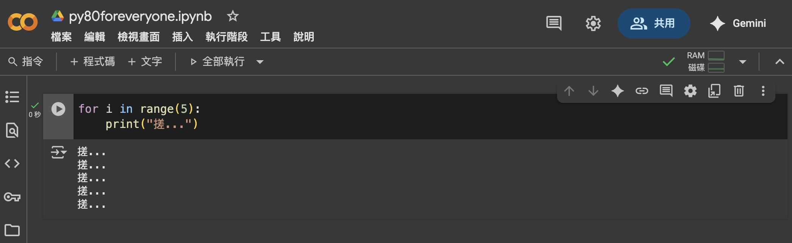
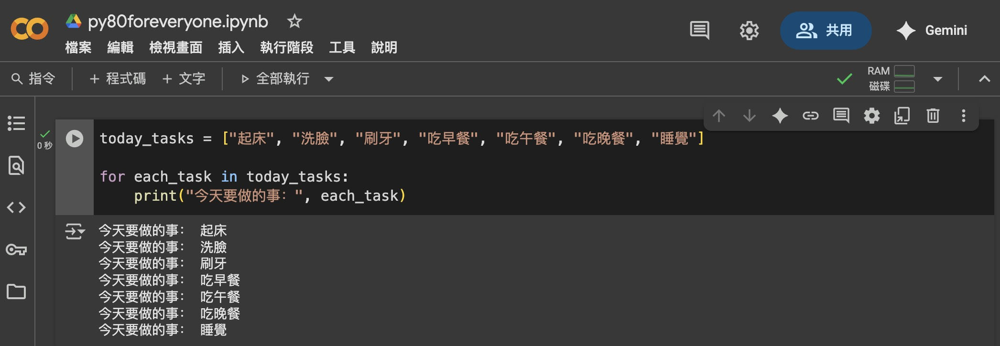
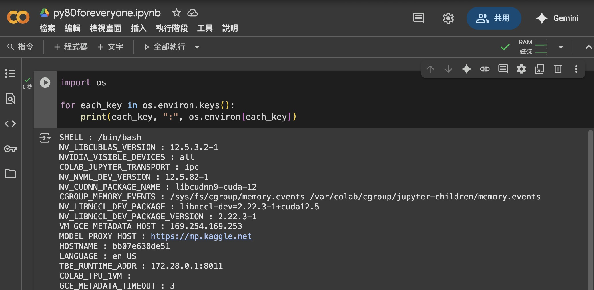

# 自動化兩大法寶：if 與 for

> 百分之八十以上的 Python 自動化都靠它們，掌握這兩個關鍵字，你就能輕鬆設計各種自動化。

## 兩種場景，兩個關鍵字

| 使用場景     | 用哪一招  | 範例                 |
| ------------ | ----- | -------------------- |
| **什麼情況下要做什麼事** | `if`  | `if weight_in_kg <= 48:`    |
| **全部掃過一次**  | `for` | `for each_task in today_tasks:` |

舉例來說，如果我們想把資料夾的所有 `csv` 檔案都移到另一個資料夾，我們可以這樣寫：

```python
for each_file in all_files_here:
    if each_file 是 csv 檔案:
        移動 each_file 到另一個資料夾
```

---

## 道理我都懂，但為什麼要空那麼多格？

Python 藉由縮排來讓電腦知道程式碼的結構，  
如果縮排錯了，結果可能完全不一樣。  
  
有個經典笑話是這樣的：  
> 老婆跟老公說：「去超市幫我買一顆西瓜，看到蘋果的話就買八顆。」  
> 老公回家後，老婆問他：「為什麼買了八顆西瓜。」  
> 老公說：「我看到蘋果了。」
  
透過縮排，我們可以清楚展示老婆的邏輯：  

>- 買一顆西瓜  
- 如果有看到蘋果  
    - 買八顆蘋果 

而老公的邏輯縮排是這樣的：  

>- 如果有看到蘋果  
    - 買八顆西瓜
- 如果沒有看到蘋果
    - 買一顆西瓜
  
---

透過縮排，我們可以清楚知道什麼指令對應什麼動作。  
在 Python 中實現縮排非常容易，只要按 `Tab` 鍵就行了。  
  
如果今天判斷當中還有判斷怎麼辦？  
很簡單，一次 `Tab` 不夠，你可以按兩次呀：

```python
if test_score >= 60:
    print("恭喜及格")

else:  
    # else 是另一個常用的邏輯關鍵字
    # 代表「如果不符合前面的 if，就執行這個」

    if weight_in_kg >= 55:
        print("好啦，給你補考機會")
        # 像這樣縮排後、再縮排

    else:
        print("抱歉啦明年見")
```

---

## Python 中的數學等號

還記得在**變數**章節我們提到 `=` 代表「貼標籤放資料」嗎？  
那我們要怎麼在 Python 中表示「數學上的等於」呢？  
  
既然 `=` 被用掉了，那我們就用 `==` 來表示數學上的等於：  

```python
if test_score == 60:
    print("運氣真好，剛好及格。")
```

---

## `for` 的第一種用法：重複

這裡我們可以打開老朋友 [Google Colab](https://colab.research.google.com/?hl=zh-tw) 實際操作一下。  
媽媽說洗手至少要搓五次，我們可以這樣寫：

```python
for i in range(5):
    print("搓...")
```

執行後，你應該會看到這樣的輸出：
  


如果要搓十次怎麼辦？ 把上面的 `5` 改成 `10` 就行啦。

---

## `for` 的第二種用法：掃描

假設我們有一個待辦清單，我們可以這樣掃過裡面的每一項：

```python
today_tasks = ["起床", "洗臉", "刷牙", "吃早餐", "吃午餐", "吃晚餐", "睡覺"]

for each_task in today_tasks:
    print("今天要做的事：", each_task)
```
  


---

還記得我們在前面示範過的 `os` 套件嗎？  
我們試試看用 `for` 來列出 Colab 環境中有什麼變數：
> 還記得之前學過的字典嗎？  
> 忘記了沒關係，問 AI 就對了；全部都記得的人才奇怪。

```python
import os

for each_key in os.environ.keys():
    print(each_key, ":", os.environ[each_key])
```



---

## 你可以這樣問 AI

- Python 中要怎麼設定「不等於」或「大於等於」的條件？
- Python 中只有 if 跟 else 可以用嗎？ 如果我要比較很多個條件怎麼辦？
- 多給我一些 Python range 的範例。
- Python 中怎麼用 for 幫每個檔案都加上日期？

---

<script src="https://giscus.app/client.js"
        data-repo="tamio0800/py80foranyone"
        data-repo-id="R_kgDOPWvXEw"
        data-category="[在此輸入分類名稱]"
        data-category-id="[在此輸入分類 ID]"
        data-mapping="pathname"
        data-strict="0"
        data-reactions-enabled="1"
        data-emit-metadata="0"
        data-input-position="top"
        data-theme="preferred_color_scheme"
        data-lang="zh-TW"
        crossorigin="anonymous"
        async>
</script>


