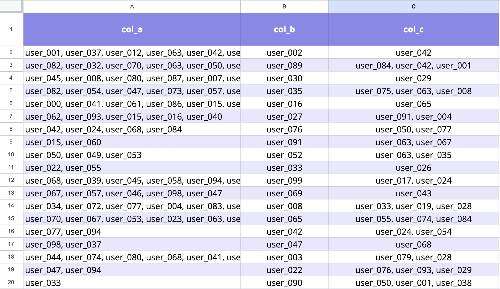
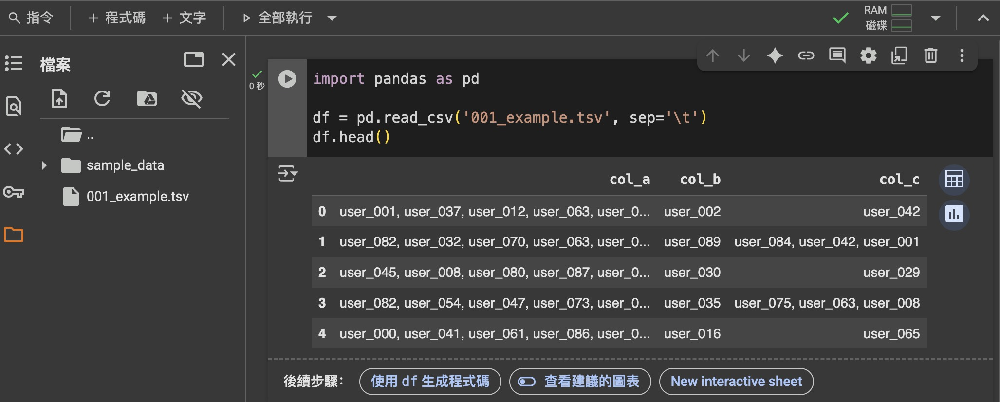
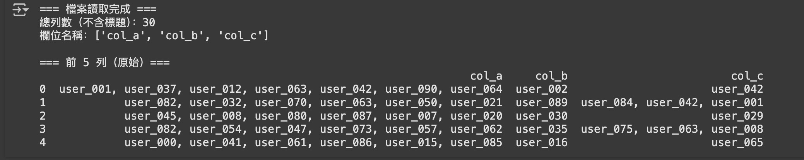
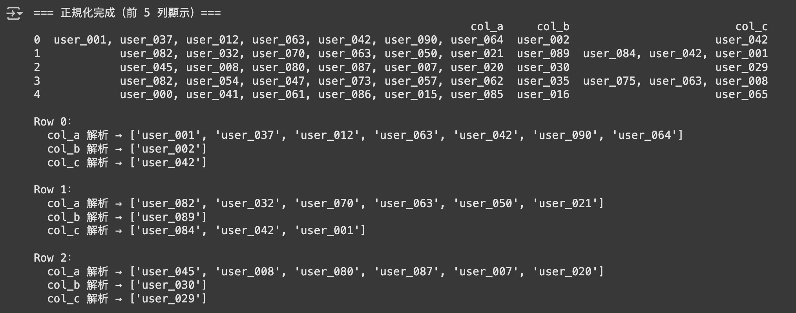

# 自動化實戰：複雜欄位比對

> 接下來我會模擬如何在不熟悉 Python 語法與程式設計的狀況下，仍然可以透過與 AI 的協作來完成實際任務。

---

## 環境準備

### 1.資料說明

還記得之前的 [範例檔案](data/001_example.tsv) 嗎？  
請先下載它後、再上傳到 [Google Colab](https://colab.research.google.com/?hl=zh-tw)。  
  
這個檔案是一個包含三個 column 的 table，總共有三十個 row （不包含標題），大致上的結構如下：  

| col_a | col_b | col_c |
|----|------|-----|
| 一個到多個用戶 id 組合  | 單一用戶 id | 一個到多個用戶 id 組合  |
| 一個到多個用戶 id 組合  | 單一用戶 id  | 一個到多個用戶 id 組合  |
| 一個到多個用戶 id 組合  | 單一用戶 id| 一個到多個用戶 id 組合  |
  
其中，多個用戶 id 組合的話，id 與 id 之間會用 `,` 連著一個「空格」隔開。  

---

### 2.使用 Google Sheet 查看資料

你也可以用 [Google Sheet](https://docs.google.com/spreadsheets/u/0/) 匯入這個檔案驗證看看。  

匯入的時候要自訂分隔符為「定位點」，不然格式會跑掉；我跟你一樣不曉得「定位點」是什麼東西，很多時候我也是東試試西試試才知道「噢，原來要這樣做！」 所以遇到問題的時候不要洩氣也不要擔心，自己大膽嘗試看看或是問問 AI，通常都能找到解決方法。  
  
至於「這樣不求甚解」真的沒關係嗎？ 這是我自己的想法、不一定正確：「我認為不了解的東西實在太多了，重要的事情儘量搞清楚，不重要的事情就隨它去吧。 如果你不確定一件事情重不重要，那麼十之八九都不是很重要。」 萬一你判斷錯誤了怎麼辦？ 別擔心，那件事情會用某種方式教育你：「它其實很重要」，下次我們記取教訓增加判斷力就行了。  
  

  
匯入後你可以看到類似下面的結構：  
  


---

### 3.使用 Python 讀取資料

接下來我們要用 Python 來讀取剛剛上傳的資料。  
這裡我們 follow 前面學過的東西就好了。  

```python
import pandas as pd

df = pd.read_csv('data/001_example.tsv', sep='\t')
df.head()
```
  

  
到這邊，我們的準備工作就完成啦。  

---

## 任務說明
  
我們打算逐一比對 `col_c` 的欄位，並找出這個欄位中哪些「用戶 id」在 `col_a` 中出現過，有出現過的話就：   

1. 新建立一個 column，叫做 `col_c_in_col_a`。
2. 我們在新欄位中填入 `col_c` 中的用戶 id，前提是這些用戶 id 在 `col_a` 中有出現過，並且在下面附上 hit 中 `col_a` 的值、以及 row index 方便未來查看。

有三件事情要特別注意：

1. 同樣一個用戶 id 在 `col_a` 中可能出現多次，必須逐一比對。
2. `col_c` 中的欄位中可能包含多個用戶 id ，必須逐一檢查。
3. 在程式設計的領域中，index 通常是從 0 開始計算的，這裡我們也遵循這個規則。


---

新的 table 大概會是這樣的結構：  

| col_a | col_b | col_c | col_c_in_col_a |
|----|------|-----|-----|
| 一個到多個用戶 id 組合  | 單一用戶 id | 一個到多個用戶 id 組合  | user_id in c<br>[col_a_index] >> col_a_value <br> [col_a_index] >> col_a_value|
| 一個到多個用戶 id 組合  | 單一用戶 id  | 一個到多個用戶 id 組合  | user_id in c<br>[col_a_index] >> col_a_value <br> ...... <br><br> user_id in c<br>[col_a_index] >> col_a_value <br>[col_a_index] >> col_a_value|
| 一個到多個用戶 id 組合  | 單一用戶 id| 一個到多個用戶 id 組合  | ...... |
  
> 請確保真的理解這一節的內容，再繼續往下。

---

## 動手環節

### 拆解成小積木

我們讓 AI 協助我們把這個任務拆解成小步驟，你可以先試試自己寫 prompt，再比對我們 prompt 與結果的差異。  
  
我的 prompt：  

```
請詳細閱讀我下面的敘述、並理解我的需求。 
我已經將這個檔案上傳到 Google Colab 上了，檔名是「001_example.tsv」，請協助我：
1. 建議我怎麼樣將這個需求拆成小步驟
2. 提供我每個步驟的 python code，並且印出可以讓我進行 debug 與確認你是否做對的資訊；同時也別忘了附上詳細的繁體中文註釋。

《下面是我的敘述》
我有一個檔案，它是一個包含三個 column... (這邊貼上「資料說明」的描述)

我們打算逐一比對 col_c 的欄位... (這邊貼上「任務說明」的描述)
```

ChatGPT 思考後把這個任務分成六個步驟：  

1. 載入套件與設定檔名
2. 讀取 TSV + 基本健檢（列數、欄位名、前幾列）=
3. 正規化三欄的使用者 ID 組合字串（統一分隔符、去除多餘空白）
4. 建立 col_a 的「反向索引」（user_id → 出現在哪些列、其 col_a 原值）
5. 逐列解析 col_c 的 user_id，對照第 4 步的索引，產生 col_c_in_col_a
6. 儲存最終寬表（wide）結果為 `001_example_with_hits.tsv`

讓我們逐步看看每個步驟的建議以及跑出來的成果吧。

### 步驟一：載入套件與設定檔名

<details> <summary>點我看 AI 建議的程式碼</summary>
<pre><code>
# --- 步驟 1：載入套件與設定檔名 ---

import re
import pandas as pd
from collections import defaultdict

# << Colab 檔名/路徑設定 >>
INPUT_PATH = "001_example.tsv"

# 如果你把檔案放在 Google Drive：
# from google.colab import drive
# drive.mount('/content/drive')
# INPUT_PATH = "/content/drive/MyDrive/你的資料夾/001_example.tsv"

OUTPUT_WIDE_PATH = "001_example_with_hits.tsv"
OUTPUT_LONG_PATH = "001_example_hits_long.tsv"
</code></pre>
</details>
  
這個步驟沒有進行任何運算，也就沒有輸出結果，但你好奇的話仍然可以使用 `print()` 來查看變數的內容。  

---

### 步驟二：讀取 TSV + 基本健檢

```python
# --- 步驟 2：讀檔與基本健檢 ---

# 讀取 TSV（預防 ID 被自動轉型，統一以字串讀入）
df = pd.read_csv(INPUT_PATH, sep="\t", dtype=str, keep_default_na=False)

print("=== 檔案讀取完成 ===")
print(f"總列數（不含標題）：{len(df)}")  # 你期待是 30
print(f"欄位名稱：{list(df.columns)}")

# 檢查是否含有預期欄位
expected_cols = {"col_a", "col_b", "col_c"}
missing = expected_cols - set(df.columns)
if missing:
    raise ValueError(f"找不到欄位：{missing}，請確認檔案標題列是否為 col_a, col_b, col_c")

# 顯示前 5 列，確認基礎內容
print("\n=== 前 5 列（原始）===")
print(df.head(5).to_string(index=True))
```
  
印出來的資訊如下，看起來似乎沒什麼問題。  



---

### 步驟三：正規化三欄的使用者 ID 組合字串
  
> (AI 的原文)  
目標：把「一個到多個用戶 id 組合」統一成 id1, id2, id3 的格式（逗號後一個空白），避免「全形逗號」、「多空白」等問題造成比對失準。

```python
# --- 步驟 3：正規化欄位字串 ---

def normalize_combo(text: str) -> str:
    """
    將包含多個 user_id 的字串正規化為統一格式："id1, id2, id3"
    規則：
      1) 將全形/特殊分隔符（，、）換成半形逗號 ,
      2) 逗號左右空白統一為一個半形空白（', '）
      3) 移除開頭/結尾多餘的逗號或空白
      4) 保留原本的大小寫（如需不分大小寫比對，可再補 lower()）
    """
    if text is None:
        return ""
    s = str(text).strip()
    if not s:
        return ""
    # 將中文逗號、頓號等替換為半形逗號
    s = re.sub(r"[，、]", ",", s)
    # 將「逗號左右的空白」標準化為 ", "
    s = re.sub(r"\s*,\s*", ", ", s)
    # 多重空白縮成一個空白
    s = re.sub(r"\s+", " ", s)
    # 去除開頭/結尾的逗號與空白
    s = s.strip(", ").strip()
    return s

def parse_ids(text: str) -> list:
    """
    將正規化後的字串切成 ID 清單。若為空，回傳空清單。
    """
    s = normalize_combo(text)
    if not s:
        return []
    return [x.strip() for x in s.split(", ") if x.strip()]

# 對三個欄位做正規化（col_b 雖然是單一 id，但統一清理空白也無妨）
for c in ["col_a", "col_b", "col_c"]:
    df[c] = df[c].map(lambda x: normalize_combo(x))

print("=== 正規化完成（前 5 列顯示）===")
print(df.head(5).to_string(index=True))

# 額外 debug：顯示每欄位的分隔情況（只看前 3 列）
for i in range(min(3, len(df))):
    print(f"\nRow {i}：")
    print("  col_a 解析 →", parse_ids(df.loc[i, "col_a"]))
    print("  col_b 解析 →", parse_ids(df.loc[i, "col_b"]))
    print("  col_c 解析 →", parse_ids(df.loc[i, "col_c"]))
```
  
即使你看不太出來這段程式碼的意思，看到下面的輸出後應該大致上也能明白，它的目的是把欄位中的字串轉變成列表。  



---

### 步驟四：建立 col_a 的反向索引（user_id → 在 col_a 哪些列出現）

> (AI 的原文)  
因為同一個 user_id 可能在 col_a 多列出現，所以要把所有命中位置都記起來。

```python
# --- 步驟 4：建立 col_a 反向索引 ---

id_to_a_hits = defaultdict(list)  # user_id -> List[(row_index, col_a_value)]

for idx, a_raw in df["col_a"].items():
    a_ids = parse_ids(a_raw)
    for uid in a_ids:
        id_to_a_hits[uid].append((idx, a_raw))

print("=== 反向索引建立完成 ===")
print(f"col_a 中不同 user_id 總數：{len(id_to_a_hits)}")

# 顯示前 5 個 user_id 的命中樣貌做為抽查
for k in list(id_to_a_hits.keys())[:5]:
    print(f"  範例 user_id {k} → 命中 {len(id_to_a_hits[k])} 次，位置：{id_to_a_hits[k]}")
```

下面是輸出的結果：  

```
=== 反向索引建立完成 ===
col_a 中不同 user_id 總數：78
  範例 user_id user_001 → 命中 1 次，位置：[(0, 'user_001, user_037, user_012, user_063, user_042, user_090, user_064')]
  範例 user_id user_037 → 命中 5 次，位置：[(0, 'user_001, user_037, user_012, user_063, user_042, user_090, user_064'), (15, 'user_098, user_037'), (22, 'user_021, user_099, user_037, user_085, user_000'), (25, 'user_096, user_070, user_053, user_030, user_037, user_063, user_062, user_041'), (28, 'user_037, user_053, user_039, user_062, user_096, user_015, user_054, user_073, user_064')]
  範例 user_id user_012 → 命中 2 次，位置：[(0, 'user_001, user_037, user_012, user_063, user_042, user_090, user_064'), (20, 'user_015, user_010, user_017, user_088, user_012, user_085')]
  範例 user_id user_063 → 命中 4 次，位置：[(0, 'user_001, user_037, user_012, user_063, user_042, user_090, user_064'), (1, 'user_082, user_032, user_070, user_063, user_050, user_021'), (13, 'user_070, user_067, user_053, user_023, user_063, user_028, user_038'), (25, 'user_096, user_070, user_053, user_030, user_037, user_063, user_062, user_041')]
  範例 user_id user_042 → 命中 2 次，位置：[(0, 'user_001, user_037, user_012, user_063, user_042, user_090, user_064'), (6, 'user_042, user_024, user_068, user_084')]
```

永遠記得要手動比對一下程式跑出來的結果，你有注意到 `user_037` 並不在 `col_c` 中嗎？ 試著讀一下「步驟四」的代碼，並且思考看看為什麼會這樣。
  
<details>
<summary>點我看答案</summary>
<br>
「步驟四」的小標題中就清楚提到「建立 col_a 反向索引」了，我們也可以從下面這段程式碼看到「我們只有針對 col_a 的資料進行掃描： 
<pre><code>for idx, a_raw in df["col_a"].items():
    ......
</code></pre> 
</details>

---

### 步驟五：比對 col_c → 產生 col_c_in_col_a

> (AI 的原文)  
> 逐列處理 col_c 中的每個 user_id：  
> 
> - 若該 user_id 在 col_a 有出現，則輸出：
> 
>   <pre><code>user_id
> [col_a_index] >> col_a_value
> [col_a_index] >> col_a_value
> </code></pre>
> 
> - 多個 user_id 彼此之間以空行分隔；若該列 col_c 無任何命中，則為空字串。

下面是這個步驟的 AI 生成代碼：  

```python
# --- 步驟 5：生成 col_c_in_col_a ---

def build_hit_cell(c_ids: list, index_map: dict) -> str:
    """
    將一列 col_c 的 ID 清單，對照 col_a 反向索引，組合成多行字串。
    僅輸出「有命中的 user_id」。多個 user_id 之間以空行分隔。
    """
    blocks = []
    for uid in c_ids:
        hits = index_map.get(uid, [])
        if not hits:
            continue  # 沒命中就跳過（因需求只保留 col_a 出現過的）
        lines = [uid] + [f"[{i}] >> {val}" for (i, val) in hits]
        blocks.append("\n".join(lines))
    return "\n\n".join(blocks) if blocks else ""

# 實際套用到每一列
hit_cells = []
for idx, row in df.iterrows():
    c_ids = parse_ids(row["col_c"])
    cell_text = build_hit_cell(c_ids, id_to_a_hits)
    hit_cells.append(cell_text)

df["col_c_in_col_a"] = hit_cells

print("=== col_c_in_col_a 產生完成 ===")
# 抽查前 5 列結果
for i in range(min(5, len(df))):
    print(f"\n--- Row {i} ---")
    print("col_c =", df.loc[i, "col_c"])
    print("col_c_in_col_a ↓")
    print(df.loc[i, "col_c_in_col_a"] if df.loc[i, "col_c_in_col_a"] else "(無命中)")
```

下面是執行完畢後的輸出：

```
=== col_c_in_col_a 產生完成 ===

--- Row 0 ---
col_c = user_042
col_c_in_col_a ↓
user_042
[0] >> user_001, user_037, user_012, user_063, user_042, user_090, user_064
[6] >> user_042, user_024, user_068, user_084

--- Row 1 ---
col_c = user_084, user_042, user_001
col_c_in_col_a ↓
user_084
[6] >> user_042, user_024, user_068, user_084
[26] >> user_027, user_077, user_011, user_006, user_009, user_084, user_002

user_042
[0] >> user_001, user_037, user_012, user_063, user_042, user_090, user_064
[6] >> user_042, user_024, user_068, user_084

user_001
[0] >> user_001, user_037, user_012, user_063, user_042, user_090, user_064

--- Row 2 ---
col_c = user_029
col_c_in_col_a ↓
user_029
[29] >> user_059, user_064, user_015, user_032, user_071, user_029, user_020

--- Row 3 ---
col_c = user_075, user_063, user_008
col_c_in_col_a ↓
user_075
[27] >> user_062, user_083, user_075, user_009, user_057

user_063
[0] >> user_001, user_037, user_012, user_063, user_042, user_090, user_064
[1] >> user_082, user_032, user_070, user_063, user_050, user_021
[13] >> user_070, user_067, user_053, user_023, user_063, user_028, user_038
[25] >> user_096, user_070, user_053, user_030, user_037, user_063, user_062, user_041

user_008
[2] >> user_045, user_008, user_080, user_087, user_007, user_020

--- Row 4 ---
col_c = user_065
col_c_in_col_a ↓
(無命中)
```

輸出看起來跟任務說明是一致的，我比對了前三筆看起來沒什麼問題，建議你也試著手動比對看看。

---

### 步驟六：匯出新 table（含新欄位）

```python
# --- 步驟 6：輸出新 table（含 col_c_in_col_a）---

df.to_csv(OUTPUT_WIDE_PATH, sep="\t", index=False)
print(f"=== 已輸出新 table 到：{OUTPUT_WIDE_PATH} ===")

# 追加一些核對統計
non_empty = (df["col_c_in_col_a"].str.len() > 0).sum()
print(f"有命中的列數：{non_empty} / {len(df)}")
print("（你可以下載 TSV 後，用試算表或文字編輯器查看每格的多行內容）")
```

輸出如下：  

```
=== 已輸出新 table 到：001_example_with_hits.tsv ===
有命中的列數：27 / 30
（你可以下載 TSV 後，用試算表或文字編輯器查看每格的多行內容）
```

你可以同樣將這份 tsv 資料匯入 Google Sheet 來查看結果，它完美符合了上述的任務要求。 這邊附上 [處理後的資料](data/001_example_with_hits.tsv) 讓你可以一併比對看看。

---

## 結語

寫這個實戰章節的時候，我沒有料到 AI 第一次就成功了，我本來以為中間會有一些需要調整的地方，結果出乎我的意料之外。  

> 這個案例中使用的 ChatGPT 模型版本是 gpt-5。

這一方面說明了「**指令明確、內容完善的 prompt**」真的很重要，另一方面則是「**目前大家（搭配 AI）其實都擁有不遜於五到十年前 Python 初階或中階工程師的能力**」。 因此絕對不要妄自菲薄，相信自己的能力，大膽嘗試看看你的自動化想法吧。

---

## 課後練習

在上面的案例中，我們逐一掃描 `col_c` 的用戶 id，並比對是否 hit 中 `col_a` 中的用戶 id。  

請你試著改為掃描 `col_b` 的用戶 id，並比對是否同時 hit 中 `col_a` 與 `col_b` 中的用戶 id 吧，你可以自己定義要怎麼呈現結果。

---


<script src="https://giscus.app/client.js"
        data-repo="tamio0800/py80foranyone"
        data-repo-id="R_kgDOPWvXEw"
        data-category="[在此輸入分類名稱]"
        data-category-id="[在此輸入分類 ID]"
        data-mapping="pathname"
        data-strict="0"
        data-reactions-enabled="1"
        data-emit-metadata="0"
        data-input-position="top"
        data-theme="preferred_color_scheme"
        data-lang="zh-TW"
        crossorigin="anonymous"
        async>
</script>
